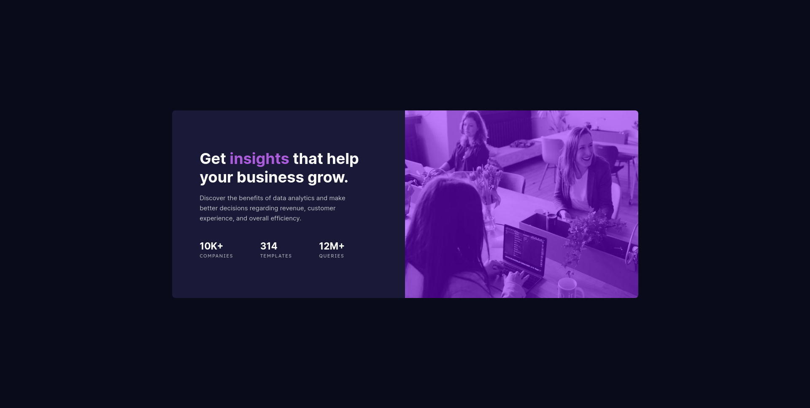

# Frontend Mentor - Stats preview card component solution

This is a solution to the [Stats preview card component challenge on Frontend Mentor](https://www.frontendmentor.io/challenges/stats-preview-card-component-8JqbgoU62). Frontend Mentor challenges help you improve your coding skills by building realistic projects.

## Table of contents

- [Overview](#overview)
  - [The challenge](#the-challenge)
  - [Screenshot](#screenshot)
  - [Links](#links)
- [My process](#my-process)
  - [Built with](#built-with)
  - [What I learned](#what-i-learned)
  - [Continued development](#continued-development)
  - [Useful resources](#useful-resources)
- [Author](#author)
- [Acknowledgments](#acknowledgments)

**Note: Delete this note and update the table of contents based on what sections you keep.**

## Overview

### The challenge

Users should be able to:

- View the optimal layout depending on their device's screen size

### Screenshot

Add a screenshot of your solution. The easiest way to do this is to use Firefox to view your project, right-click the page and select "Take a Screenshot". You can choose either a full-height screenshot or a cropped one based on how long the page is. If it's very long, it might be best to crop it.

Alternatively, you can use a tool like [FireShot](https://getfireshot.com/) to take the screenshot. FireShot has a free option, so you don't need to purchase it.

Then crop/optimize/edit your image however you like, add it to your project, and update the file path in the image above.

**Note: Delete this note and the paragraphs above when you add your screenshot. If you prefer not to add a screenshot, feel free to remove this entire section.**

### Links

- Solution URL: [https://github.com/theadg/stats-preview-card]
- Live Site URL: [https://theadg.github.io/stats-preview-card/]

## My process

### Built with

- Semantic HTML5 markup
- CSS custom properties
- Mobile-first workflow
- SASS
- Flexbox
- BEM Naming Convention

### What I learned

For this project, I have utilized the power of SASS to have multiple CSS files and import them into one. I used Flexbox to layout things for this project and it was a breeze. The only trouble I had was finding the exact color of the image overlay. I also used relative units for my font sizes to ensure user accessibility.

### Continued development

I'll be taking a deeper dive into HTML Semantic Tags to give all types of users the best experience. I'll be looking into writing less but more clean and more efficient code overall. I'll also use the min/max/clamp functions in my next projects to ensure responsiveness.

### Useful resources

- [CSS Overlay](https://www.w3schools.com/howto/howto_css_overlay.asp) - This helped me for the idea of the image overlay. I initially thought there was a CSS property for that but later found out that there wasn't. This resource is straightforward and easy to understand.

## Author

- Frontend Mentor - [theadg](https://www.frontendmentor.io/profile/theadg)
